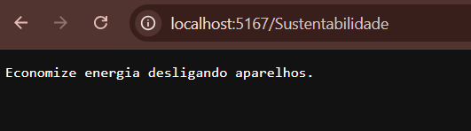

# 🌱 EcoTrack API

API desenvolvida em .NET para fornecer dicas de sustentabilidade.

## 🚀 Funcionalidades

- Retorna uma dica de sustentabilidade aleatória  
- Endpoint simples utilizando método GET  

## 🔗 Endpoint

GET /Sustentabilidade

## 💡 Exemplo de resposta

"Evite desperdício de água."

## 🛠️ Tecnologias utilizadas

- C#  
- .NET  
- ASP.NET Core Web API  

📸 Teste da API


## ▶️ Como executar

```bash
dotnet run